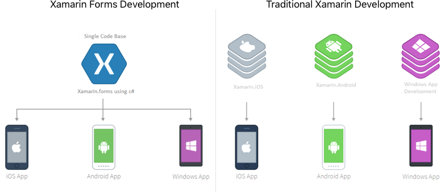

description: Xamarin Forms is a UI framework that is used to develop native cross platform mobile apps for Android, iOS and Windows UWP using C# programming language.

# Xamarin Forms Essentials

## What is Xamarin Forms
Xamarin Forms is a UI framework that is used to develop native cross platform mobile apps for Android, iOS and Windows UWP using C# programming language.

## Why Choose Xamarin Forms
- One language to rule them all, C#. You don't need to learn a myriad array of languages to develop an Android, iOS or Windows UWP app.
- Save cost. See below how much it would cost to develop a typical app for both Android and iOS.
- Quick to market. With Xamarin Forms, you develop once and deploy to both platforms.

## History
Xamarin is the company that originally built Xamarin Forms. The company was bought by Microsoft.

To develop apps using Xamarin, you had to pay a developer license for each of the platform and for each developer. This was really expensive and only corporates choose this route to build native cross platform mobile apps.

You also had to pay when running on Windows, you need to buy the Visual Studio Xamarin plugin.

The development environment that was used was called Xamarin Studio. Xamarin Studio is no longer available.

When Microsoft purchased Xamarin they made Xamarin open source and removed payment options. This helped the adoption of Xamarin.

Microsoft then integrated Xamarin into Visual Studio. You can now develop on both Windows and Mac.

## Platforms
Xamarin Forms is available on both Windows and Mac OS. You can build Xamarin Forms applications using Visual Studio on Windows and Visual Studio for Mac on OS X.

## Traditional Xamarin Development

The traditional approach also called the silo approach to Xamarin development is to develop the UI natively for each platform and share business logic.

This is different to Xamarin Forms approach. With Xamarin forms, you share the UI code and also the business logic.

## Which Xamarin approach is best for your app?

### Xamarin.Forms is best for

* Apps where code sharing is more important than custom UI
* Apps that require little platform-specific functionality
* Developers comfortable with XAML

### Xamarin.iOS & Xamarin.Android are best for:

* Apps with interactions that require native behavior
* Apps that use many platform-specific APIs
* Apps where custom UI is more important than code sharing