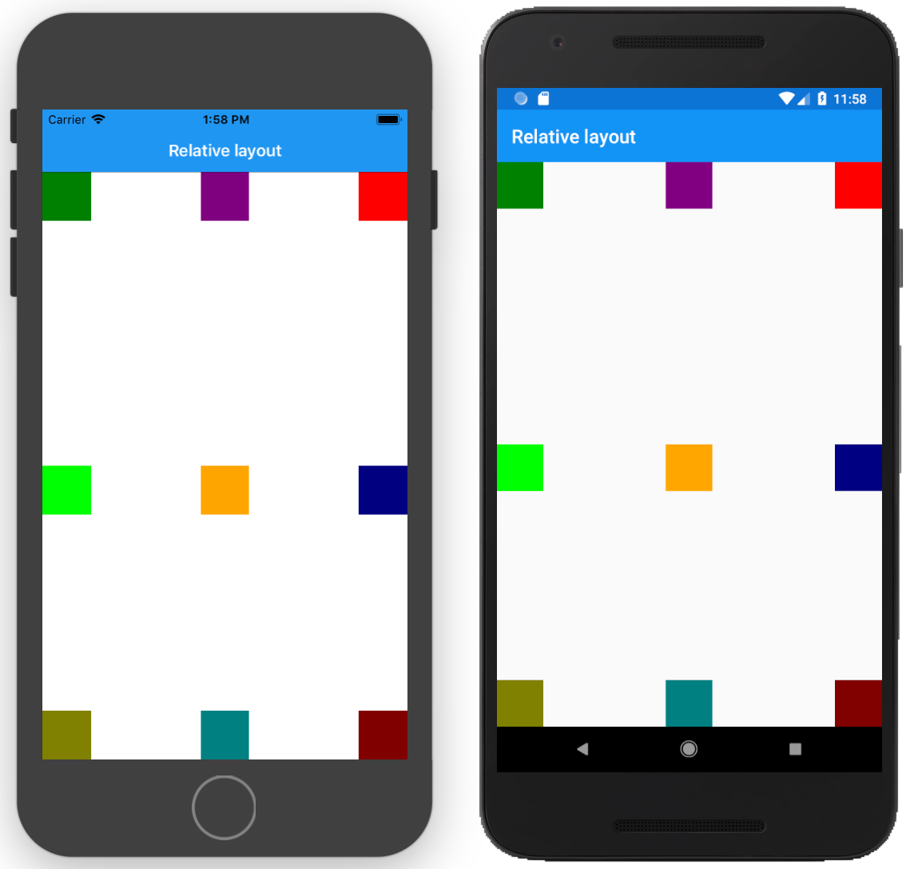
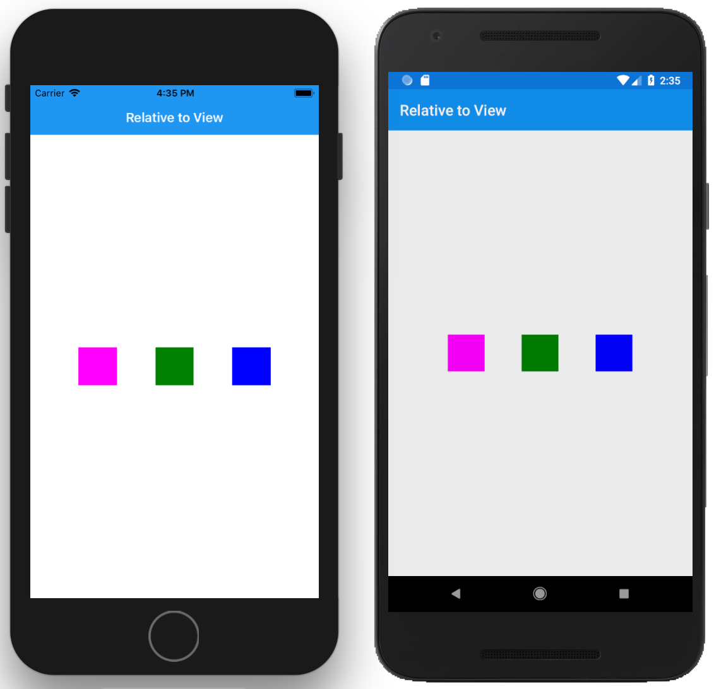

# Relative Layout

The `RelativeLayout` is used to position and size views using constraints. You can position of size views against the parent view or other sibling views.

## Constraints

The Relative layout have attached properties for changing the X, Y, Width, Height and Bounds constraint. A constraint is defined using `ConstraintExpression` in XAML and we can specify it for these properties :

* `XConstraint`
* `YConstraint`
* `WidthConstraint`
* `HeightConstraint`
* `BoundsConstraint`


### Center a BoxView in the horizontally 

Let's use the `XConstraint` to center a BoxView inside the Relative layout.


```xaml
<RelativeLayout x:Name="container">
    <BoxView x:Name="boxView" 
            WidthRequest="50" 
            HeightRequest="50" Color="Green" 
            RelativeLayout.XConstraint=
                    "{ConstraintExpression 
                        Type=RelativeToParent,
                        Property=Width, 
                        Factor=0.5,
                        Constant=-25
                        }"  />           
</RelativeLayout>
```

!!! note
    The `X` coordinate of the `BoxView` is specified as half of the width of the parent. We then apply an offset of 25 since the `BoxView` is 50 in width. This will now center the `BoxView`


### Center a BoxView horizontally and vertically


To center the `BoxView` above horizontally and vertically, we can apply both `XConstraint` and `YConstraint` and also apply a factor of `-25` on both X and Y to center the view.

```xaml
<RelativeLayout x:Name="container">
    <BoxView x:Name="boxView" 
            WidthRequest="50" 
            HeightRequest="50" 
            Color="Green" 
            RelativeLayout.XConstraint=
                    "{ConstraintExpression 
                        Type=RelativeToParent,
                        Property=Width, 
                        Factor=0.5,
                        Constant=-25
                        }"
            RelativeLayout.YConstraint=
                "{ConstraintExpression 
                        Type=RelativeToParent,
                        Property=Height,
                        Factor=0.5,
                        Constant=-25}"/>
</RelativeLayout>
```

### Align on edges



Here is an example of the Relative Layout with all the Box View on the edges.

```xaml
<RelativeLayout x:Name="container">
    <!-- Top left edge -->
    <BoxView x:Name="boxView" 
        WidthRequest="50" 
        HeightRequest="50" 
        Color="Green" 
        RelativeLayout.XConstraint=
                "{ConstraintExpression 
                    Type=RelativeToParent,
                    Property=Width, 
                    Factor=0,
                    Constant=0
                    }"/>
    <!-- Center top -->
    <BoxView 
            WidthRequest="50" 
            HeightRequest="50" 
            Color="Red" 
            RelativeLayout.XConstraint=
                    "{ConstraintExpression 
                        Type=RelativeToParent,
                        Property=Width, 
                        Factor=1,
                        Constant=-50
                        }"/>
    <!-- Right edge -->
    <BoxView 
            WidthRequest="50" 
            HeightRequest="50" 
            Color="Purple" 
            RelativeLayout.XConstraint=
                    "{ConstraintExpression 
                        Type=RelativeToParent,
                        Property=Width, 
                        Factor=0.5,
                        Constant=-25
                        }"/>
    <!-- Center left -->
    <BoxView 
            WidthRequest="50" 
            HeightRequest="50" 
            Color="Lime" 
            RelativeLayout.XConstraint=
                    "{ConstraintExpression 
                        Type=RelativeToParent,
                        Property=Width, 
                        Factor=0,
                        Constant=0
                        }" 
            RelativeLayout.YConstraint=
                        "{ConstraintExpression 
                            Type=RelativeToParent,
                            Property=Height,
                            Factor=0.5}"/> 
    <!-- Center in parent -->
    <BoxView 
            WidthRequest="50" 
            HeightRequest="50" 
            Color="Orange" 
            RelativeLayout.XConstraint=
                    "{ConstraintExpression 
                        Type=RelativeToParent,
                        Property=Width, 
                        Factor=0.5,
                        Constant=-25
                        }" 
            RelativeLayout.YConstraint=
                        "{ConstraintExpression 
                            Type=RelativeToParent,
                            Property=Height,
                            Factor=0.5}"/>
    <!-- Right center edge -->
    <BoxView 
            WidthRequest="50" 
            HeightRequest="50" 
            Color="Navy" 
            RelativeLayout.XConstraint=
                    "{ConstraintExpression 
                        Type=RelativeToParent,
                        Property=Width, 
                        Factor=1,
                        Constant=-50
                        }" 
            RelativeLayout.YConstraint=
                        "{ConstraintExpression 
                            Type=RelativeToParent,
                            Property=Height,
                            Factor=0.5}"/>
    <!-- Bottom left edge -->
    <BoxView 
            WidthRequest="50" 
            HeightRequest="50" 
            Color="Olive" 
            RelativeLayout.XConstraint=
                    "{ConstraintExpression 
                        Type=RelativeToParent,
                        Property=Width, 
                        Factor=0,
                        Constant=0
                        }" 
            RelativeLayout.YConstraint=
                        "{ConstraintExpression 
                            Type=RelativeToParent,
                            Property=Height,
                            Constant=-50,
                            Factor=1}"/>
    <!-- Bottom center -->
    <BoxView 
            WidthRequest="50" 
            HeightRequest="50" 
            Color="Teal" 
            RelativeLayout.XConstraint=
                    "{ConstraintExpression 
                        Type=RelativeToParent,
                        Property=Width, 
                        Factor=0.5,
                        Constant=-25
                        }" 
            RelativeLayout.YConstraint=
                        "{ConstraintExpression 
                            Type=RelativeToParent,
                            Property=Height,
                            Constant=-50,
                            Factor=1}"/>
    <!-- Bottom right edge -->
    <BoxView 
            WidthRequest="50" 
            HeightRequest="50" 
            Color="Maroon" 
            RelativeLayout.XConstraint=
                    "{ConstraintExpression 
                        Type=RelativeToParent,
                        Property=Width, 
                        Factor=1,
                        Constant=-50
                        }" 
            RelativeLayout.YConstraint=
                        "{ConstraintExpression 
                            Type=RelativeToParent,
                            Property=Height,
                            Constant=-50,
                            Factor=1}"/>             
</RelativeLayout>
```

### Relative to another view



We can setup our views so that they are relative to their sibling views. In the example below, we have the `BoxView` in the middle relative to the parent and then the two other `BoxView`'s relative to the center box view. 

```xaml
<RelativeLayout>
    <BoxView 
        x:Name="boxView"
        Color="Green" 
        WidthRequest="50" 
        HeightRequest="50" 
        RelativeLayout.XConstraint=
            "{ConstraintExpression 
                Type=RelativeToParent,
                Property=Width,
                Factor=0.5,
                Constant=-25}"
        RelativeLayout.YConstraint=
            "{ConstraintExpression 
                Type=RelativeToParent,
                Property=Height,
                Factor=0.5,
                Constant=-25}"/>
    <BoxView 
        x:Name="boxView2"
        WidthRequest="50" 
        HeightRequest="50" 
        Color="Fuchsia" 
        RelativeLayout.XConstraint=
            "{ConstraintExpression 
                ElementName=boxView,
                Type=RelativeToView,
                Constant=-100,
                Property=X}" 
        RelativeLayout.YConstraint=
            "{ConstraintExpression 
                Type=RelativeToView,
                ElementName=boxView,
                Property=Y,
                Constant=0}" />
    <BoxView 
        x:Name="boxView3"
        WidthRequest="50" 
        HeightRequest="50" 
        Color="Blue" 
        RelativeLayout.XConstraint=
            "{ConstraintExpression 
                ElementName=boxView,
                Type=RelativeToView,
                Constant=100,
                Property=X}" 
        RelativeLayout.YConstraint=
            "{ConstraintExpression 
                Type=RelativeToView,
                ElementName=boxView,
                Property=Y,
                Constant=0}" />
</RelativeLayout>
```