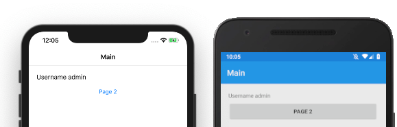

description: The Navigation class is an import class used for hierarchical navigation. The root page is wrapped inside a Navigation page and subsequent pages can be pushed or popped from the stack.

# NavigationPage

The `NavigationPage` is used for hierarchical navigation. Pages are pushed and popped onto the stack. You will mainly use the `NavigationPage` in code.

When the root page is wrapped in a `NavigationPage` subsequent pages can be pushed and popped from the stack.

## Add Root Page to NavigationPage

To add the root page to the `NavigationPage` we just need to pass the page in the constructor of the `NavigationPage` as follows :

```csharp
...
// Assign the MainPage of the App to be the NavigationPage
// and have MainPage be the root page of the navigation
MainPage = new NavigationPage(new MainPage());
...
```

With the above code, a navigation bar will be added in an iOS app, and a toolbar in an Android app.

## Add Title to the Navigation Page

When you add a `Title` property to the page, it will be displayed in the `Toolbar` in Android and the `Navigation Bar` in iOS.

The `Title` can be added in code as follows : 

```csharp
...
// Assign the MainPage of the App to be the NavigationPage
// and have MainPage be the root page of the navigation
MainPage = new NavigationPage(new MainPage() { Title = 'Main' });
...
```

or it can be added in XAML as follows :

```xml
<?xml version="1.0" encoding="utf-8"?>
<ContentPage 
  Title="Main" 
  Icon="heart" 
  Padding="20" 
  xmlns="http://xamarin.com/schemas/2014/forms" 
  xmlns:x="http://schemas.microsoft.com/winfx/2009/xaml" 
  xmlns:local="clr-namespace:NavigationDemo" x:Class="NavigationDemo.MainPage">
```

We will get the following :




## Navigating with a Button Click

We will add an event handler to the button and navigate to the next page.

MainPage.xaml

```xml
<?xml version="1.0" encoding="utf-8"?>
<ContentPage Title="Main" Icon="heart" Padding="20" xmlns="http://xamarin.com/schemas/2014/forms" xmlns:x="http://schemas.microsoft.com/winfx/2009/xaml" xmlns:local="clr-namespace:NavigationDemo" x:Class="NavigationDemo.MainPage">
    <StackLayout>
        <Label Text="{Binding Username, StringFormat='Username {0}'}" />
        <Button Text="Page 2" Clicked="GotoPage2" />
    </StackLayout>
</ContentPage>
```

and in the `MainPage.xaml.cs` we will have the following  method defined to handle the click event

```csharp
public partial class MainPage : ContentPage
{
    // Handle the click event
    // and navigate to Page 2
    async void GotoPage2(object sender, System.EventArgs e)
    {
        await Navigation.PushAsync(new Page2());
    }
}
```
