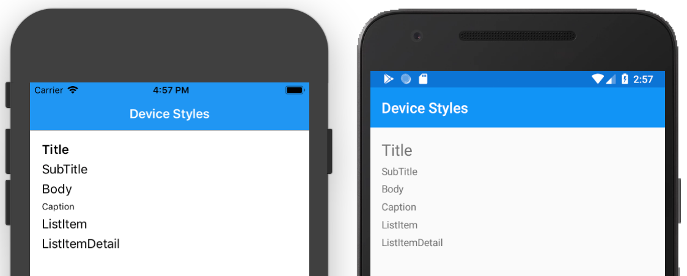

description: Styling a Xamarin.Forms app is traditionally accomplished by using the Style class to group a collection of property values into one object that can then be applied to multiple visual element instances. This helps to reduce repetitive markup, and allows an apps appearance to be more easily changed.

# Styling Apps

Styling a Xamarin.Forms app is traditionally accomplished by using the `Style` class to group a collection of property values into one object that can then be applied to multiple visual element instances. This helps to reduce repetitive markup, and allows an apps appearance to be more easily changed.

Styles are defined in the `ResourceDictionary` under `Resouces` in a XAML file.

## Types of Styles

They are different types of styles than can be used in a Xamarin Forms apps :

* Explicit Styles
* Implicit Styles
* Global Styles
* Dynamic Styles
* Device Styles


## Explicit Styles

Explicit styles need to be explicitly referenced for a control and also contains a key when they are defined. To define an explicit style, add a key to the Style definition.

```xaml
 <Style x:Key="TransparentButtonStyle" TargetType="Button">
 ...
 </Style>
```

We are  defining a style with a key `TransparentButtonStyle` for the Button class.  

!!! note
    When defining styles, the `TargetType` is a required property. You can not define a style without a `TargetType`.

We can then use the various `Setter`'s to define the properties we need for that styles. We have create a button style with a transparent background with a thin gray border :

```xaml
<ContentPage.Resources>
    <ResourceDictionary>
        <Style x:Key="TransparentButtonStyle" TargetType="Button">
            <Setter Property="BackgroundColor" Value="Transparent" />
            <Setter Property="BorderColor" Value="Silver" />
            <Setter Property="BorderWidth" Value="1" />
            <Setter Property="BorderRadius" Value="2" />
            <Setter Property="TextColor" Value="Gray" />
        </Style>
    </ResourceDictionary>            
</ContentPage.Resources>
```

!!! note
    Note that in this instance the style is defined with the `ContentPage`. When the same style is defined in the `App` XAML file then it becomes a global style. This style is only available within the `ContentPage` is defined on.

### Applying the Explicit Style


To apply the style to the control we can reference it as a `StaticResource` using the `Style` property as follows :

```xml
<Button Text="Explicit Style" Style="{StaticResource TransparentButtonStyle}" />
```


## Implicit Styles

Implicit styles do not specify a key when they are defined. The style will be automatically be applied to all controls of the specified `TargetType`.

We can change the above style and just remove the `Targettype` to make it an implicit style  as follows :


```xaml
<ContentPage.Resources>
    <ResourceDictionary>
        <Style TargetType="Button">
            <Setter Property="BackgroundColor" Value="Transparent" />
            <Setter Property="BorderColor" Value="Silver" />
            <Setter Property="BorderWidth" Value="1" />
            <Setter Property="BorderRadius" Value="2" />
            <Setter Property="TextColor" Value="Gray" />
        </Style>
    </ResourceDictionary>            
</ContentPage.Resources>
```

## Global Styles

The global styles are defined in the `App` class's XAML file. The styles will be available to the entire application. The global styles can be either implicit or explicit.

We have changed the location of the implicit style previous defined and placed the style in the application's XAML file :

```xml
    <Application.Resources>
        <ResourceDictionary>
            <Color x:Key="ColorPrimary">#CC0033</Color>
            <Color x:Key="ColorPrimaryDark">#FFF</Color>
            <Style  TargetType="Button">
                <Setter Property="BackgroundColor" Value="Transparent" />
                <Setter Property="BorderColor" Value="Silver" />
                <Setter Property="BorderWidth" Value="1" />
                <Setter Property="BorderRadius" Value="2" />
                <Setter Property="TextColor" Value="Gray" />
            </Style>            
        </ResourceDictionary>
    </Application.Resources>
```

!!! note
    Note that the style in now defined in the `ResourceDictionary` under the ` <Application.Resources>`. The styles defined here and resources are available to the entire app.

We can also define explicit styles by assigning a key to the style as follows :

```xml
<Application.Resources>
    <ResourceDictionary>
        <Color x:Key="ColorPrimary">#CC0033</Color>
        <Color x:Key="ColorPrimaryDark">#FFF</Color>
        <Style x:Key="TransparentButtonStyle"  TargetType="Button">
            <Setter Property="BackgroundColor" Value="Transparent" />
            <Setter Property="BorderColor" Value="Silver" />
            <Setter Property="BorderWidth" Value="1" />
            <Setter Property="BorderRadius" Value="2" />
            <Setter Property="TextColor" Value="Gray" />
        </Style>            
    </ResourceDictionary>
</Application.Resources>
```

!!! note
    Note that we have changed the implicit style to an explicit style by assigning a key to the style as follows, ` <Style x:Key="TransparentButtonStyle"  TargetType="Button">`. We can access the style the same way anywhere within the app.


## Dynamic Styles

We referencing styles using the `StaticResource` the styles are only read once. This means if the style does change during runtime, the app will not update the style. We simply change how a style is referenced by using the `DynamicResource` XAML extension instead. This will keep a reference to the style and be updated when the style changes.

We are going to first show an example of reading a resource and then do the same for the style :

```xml
<ResourceDictionary>
    <x:String x:Key="CurrentDate">Will show a date if accessed dynamically</x:String>
</ResourceDictionary>
```

We define a string resource and assign a key. We are going to reference the string using the key as follows :

```xml
<Label Text="{DynamicResource CurrentDate}" />
```

Initially the text will be displayed but we are going to change the resource in code as follows :

```csharp
Device.StartTimer(TimeSpan.FromSeconds(1), () =>
{
    Resources["CurrentDate"] = DateTime.Now.ToString("hh:mm:ss");
    return true;
});
```

You will notice that the text will now display the current date and time. We can achieve the same for the styles.

To show the difference between the two, we are using the same key but change the XAML extensions we use to access the resource as follows :

```xml
<Label Text="{DynamicResource CurrentDate}" />
<Label Text="{StaticResource CurrentDate}" />
```

<video style="width:100%" src="../video/dynamic-styles.mov" controls ></video>

## Device Styles

Xamarin Forms includes six dynamic styles, known as device styles, in the Device.Styles class.

The device styles are:

* BodyStyle
* CaptionStyle
* ListItemDetailTextStyle
* ListItemTextStyle
* SubtitleStyle
* TitleStyle

All six styles can only be applied to `Label` instances. For example, a Label that's displaying the body of a paragraph might set its Style property to `BodyStyle`



```xml
<StackLayout>
    <Label Text="Title" Style="{DynamicResource TitleStyle}" />
    <Label Text="SubTitle" Style="{DynamicResource SubTitleStyle}" />
    <Label Text="Body" Style="{DynamicResource BodyStyle}" />
    <Label Text="Caption" Style="{DynamicResource CaptionStyle}" />
    <Label Text="ListItem" Style="{DynamicResource ListItemStyle}" />
    <Label Text="ListItemDetail" Style="{DynamicResource ListItemDetailStyle}" />
</StackLayout>
```

