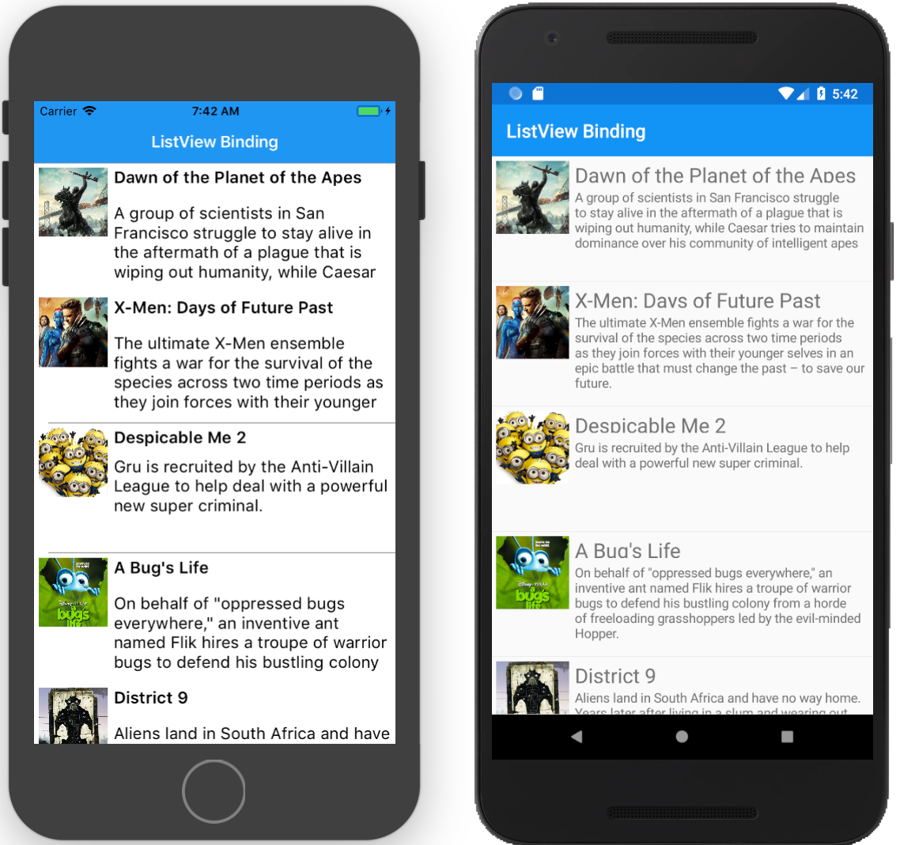

# ListView

The `ListView` is one of the most popular controls. It's used to display a list of data. The list view automatically scrolls when the content does not fit the screen.

## Components of a ListView

The ListView have a number of components to match the native functionality of the list view on each platform.

* Cells
* Headers and Footers
* Groups

### Cells

Data in the list view is presented using cells. Each cell corresponds to a row of data. There are built-in cells to display text and text with an image :

* **TextCell** - Displays text with an optional detail text.
* **ImageCell** - Displays an image with text
* **Custom Cell** - We can create custom cells when we need to customize the contents of each cell.

## Functionality

The list view supports the following actions :

* Context actions
* Pull to refresh
* Selection

## Data Source

The list data is provided through the `ItemsSource` property. This can be any enumerable. If the items are objects, by default the list view uses the `ToString()` method when displaying the row. You can see data binding to choose which fields to display from the object.

We will define an array as a data source in code and use it as the source in the xaml :

```csharp
public static string[] Months = new[]{
        "January",
        "February",
        "March",
        "April",
        "May",
        "June",
        "July",
        "August",
        "September",
        "October",
        "November",
        "December"
    };
```

We will use the `x:StaticResource` to refer to the Months static array in the code behind file :

```xaml
 <ListView ItemsSource="{x:Static local:ListViewPage.Months}" />
```

For the above to work, we will need add the namespace for the prefix `local` as follows :

```xaml
xmlns:local="clr-namespace:DataBindingDemo.Movies"
```

The `Movies` static property is defined in the class `ListViewPage` in the `DataBindingDemo.Movies` namespace.

*ListViewPage.xaml*

```xaml
<?xml version="1.0" encoding="UTF-8"?>
<ContentPage 
    xmlns="http://xamarin.com/schemas/2014/forms" 
    xmlns:local="clr-namespace:DataBindingDemo.Movies"
    xmlns:x="http://schemas.microsoft.com/winfx/2009/xaml" 
    x:Class="DataBindingDemo.Movies.ListViewPage">
    <ContentPage.Content>
        <StackLayout>
            <ListView ItemsSource="{x:Static local:ListViewPage.Months}" />
        </StackLayout>
    </ContentPage.Content>
</ContentPage>
```

*ListViewPage.xaml.cs*

```csharp
using System;
using System.Collections.Generic;

using Xamarin.Forms;

namespace DataBindingDemo.Movies
{
    public partial class ListViewPage : ContentPage
    {
        public static string[] Months = new[]{
            "January",
            "February",
            "March",
            "April",
            "May",
            "June",
            "July",
            "August",
            "September",
            "October",
            "November",
            "December"
        };        
        public ListViewPage()
        {
            InitializeComponent();
        }
    }
}
```

## Data Binding ListView



We can easily bind the row of the list view to a data source. We have a model for a Movie :

*Movie.cs*

```csharp
public class Movie
{

    [JsonProperty("objectId")]
    public string ObjectId { get; set; }

    [JsonProperty("image")]
    public Image Image { get; set; }

    [JsonProperty("createdAt")]
    public DateTime CreatedAt { get; set; }

    [JsonProperty("updatedAt")]
    public DateTime UpdatedAt { get; set; }

    [JsonProperty("title")]
    public string Title { get; set; }

    [JsonProperty("releaseYear")]
    public string ReleaseYear { get; set; }

    [JsonProperty("genre")]
    public IList<string> Genre { get; set; }

    [JsonProperty("rating")]
    public double Rating { get; set; }

    [JsonProperty("description")]
    public string Description { get; set; }
}
```

*ApiResult.cs*
```csharp
public class ApiResult
{
    [JsonProperty("results")]
    public IEnumerable<Movie> Movies { get; set; }
}
```

*Image.cs*
```csharp
public class Image
{
    [JsonProperty("name")]
    public string Name { get; set; }

    [JsonProperty("url")]
    public string Url { get; set; }
}
```

And this is the link to the [full json](../files/movies.json)  with the movie data.

And a model to fetch the data, and within the model we have an `ObservableCollection` of a Movie :

```csharp
    public class MoviesViewModel : BaseViewModel {
        ObservableCollection<Movie> _movies;
        public ObservableCollection<Movie> Movies
        {
            get
            {
                if (_movies == null)
                {
                    _movies = new ObservableCollection<Movie>();
                }
                return _movies;    
            }
            set
            {
                if (value != _movies)
                {
                    _movies = value;
                    OnPropertyChanged();
                }
            }
        }

        public MoviesViewModel()
        {
            Task.Run(async () =>
            {
                var movies = await GetMovies();
                movies.ForEach(Movies.Add);
            });
        }

        private async  Task<IEnumerable<Movie>> GetMovies(){
            var client = new HttpClient();
            try
            {
                IsBusy = true;
                var data = await client.GetStringAsync("replace with url to json file");
                IsBusy = false;
                return JsonConvert.DeserializeObject<ApiResult>(data).Movies;
            }
            catch (Exception ex)
            {
                IsBusy = false;
                Debug.WriteLine(ex.Message);
                return null;
            }
        }
    }
```

Then in the XAML, we bind the rows to the movie collection

```xaml
<ListView RowHeight="100" AbsoluteLayout.LayoutFlags="All" AbsoluteLayout.LayoutBounds="1,1,1,1" ItemsSource="{Binding Movies}">
    <ListView.ItemTemplate>
        <DataTemplate>
            <ViewCell>
                <Grid Padding="5">
                    <Grid.RowDefinitions>
                        <RowDefinition Height=".3*" />
                        <RowDefinition Height=".7*" />
                    </Grid.RowDefinitions>
                    
                    <Grid.ColumnDefinitions>
                        <ColumnDefinition Width=".2*" />
                        <ColumnDefinition Width=".8*" />
                    </Grid.ColumnDefinitions>

                    <Image HorizontalOptions="Start" VerticalOptions="Start"  Source="{Binding Image.Url}" Grid.RowSpan="2" />
                    <Label HorizontalOptions="Start" Text="{Binding Title}" Grid.Column="1" Style="{DynamicResource TitleStyle}" />
                    <Label HorizontalOptions="Start" Text="{Binding Description}" Grid.Row="1" Grid.Column="1" Style="{DynamicResource BodyStyle}" />
                </Grid>
            </ViewCell>
        </DataTemplate>
    </ListView.ItemTemplate>
</ListView> 
```

!!! note
    The row for each ListView is bound to a a movie. the two `Label`s and `ImageView` are bound to the properties of a movie. 

and in the code behind file, we have set the `BindingContext` as follows :

```csharp
public MoviesPage()
{
    InitializeComponent();
    var vm = new MoviesViewModel();
    BindingContext = vm;
}
```