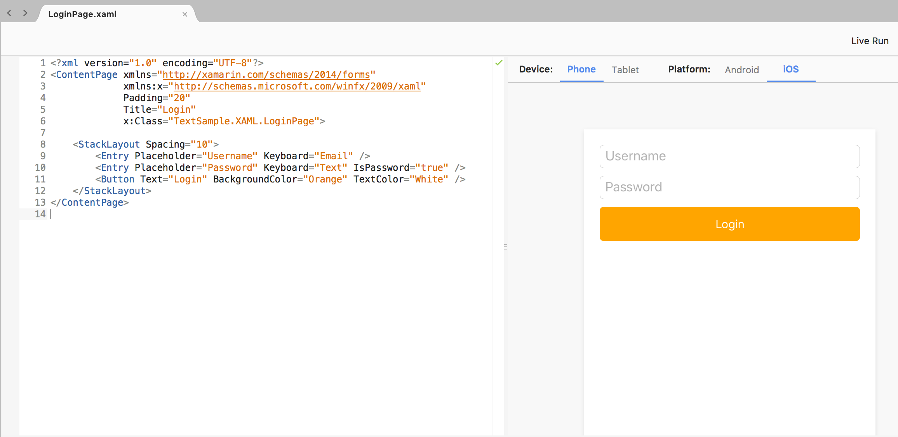

description: XAML stands for Extensible Markup Language. Its used in developing Windows UWP applications. XAML is also used to develop the user interface for Xamarin.Forms applications.

# Introduction XAML


XAML stands for **Extensible Markup Language**. XAML is the preferred way for creating the UI in Xamarin Forms apps. XAML is also used in creating Windows UWP applications.

The version for Windows UWP is not the same as the one used for Xamarin.Forms applications but there's effort to standardize the different XAML versions.

## Design Interface

Unlike Android Studio and XCode that comes with a visual design tool, there's no drag and drop tool in Visual Studio for creating the UI with XAML. 

We will largely depend with intelli-sense for auto-completing the XAML. In some instances the intelli-sense will stop working and you might be forced to restart Visual Studio.

## File Structure

XAML files are composed of two files. The UI and the code behind. If we were to create an example _Login_ page we would have the following :

* `Login.xaml` - XAML UI
* `Login.xaml.cs` - Code behind for the UI


## XAML UI Structure

A XAML view is composed of a `Page`. Within the `Page` different `Layouts` can be used and within the `Layout` several views are used to created the UI.

Here is a simplified structure of a single XAML view.


## Code vs XAML

Instead of using XAML, we can also create the UI entirely in code.

!!! note
    Creating UIs in code is not recommended and does not promote code sharing. When creating most apps, designers need to beautify the app, and not many designers can code. Designers can easily work in XAML without having to touch the underlying code for the app.

*Login.xaml*

```xml
<?xml version="1.0" encoding="UTF-8"?>
<ContentPage xmlns="http://xamarin.com/schemas/2014/forms" 
             xmlns:x="http://schemas.microsoft.com/winfx/2009/xaml" 
             x:Class="TextSample.XAML.LoginPage">
    <ContentPage.Content>
    </ContentPage.Content>
</ContentPage>
```

*Login.xaml.cs*

```csharp
using System;
using System.Collections.Generic;

using Xamarin.Forms;

namespace TextSample.XAML
{
    public partial class LoginPage : ContentPage
    {
        public LoginPage()
        {
            InitializeComponent();
        }
    }
}
```

## Page

XAML pages derive from the `Page` class. The most commong type of the page is the `ContentPage`. A page usually takes the whole screen or part of the screen. The default project template creates a simple `ContentPage`.

The contents of a `ContentPage` are assigned in the `Content` property. The `Content` property can only take one child. In XAML, `Content` property is the default, so we do not need to specify it, we can just start populating the content as follows :

```xml
<?xml version="1.0" encoding="UTF-8"?>
<ContentPage xmlns="http://xamarin.com/schemas/2014/forms" 
             xmlns:x="http://schemas.microsoft.com/winfx/2009/xaml" 
             Padding="20"
             Title="Login"
             x:Class="TextSample.XAML.LoginPage">

    <StackLayout Spacing="10">
        <Entry Placeholder="Username" Keyboard="Email" />
        <Entry Placeholder="Password" Keyboard="Text" IsPassword="true" />
        <Button Text="Login" BackgroundColor="Orange" TextColor="White" />
    </StackLayout>
</ContentPage>
```
!!! note
    With the XAML previewer we can see the preview as we build the page.



## Page Types

Out of the box, Xamarin Forms have the following `Pages` available :

1. ContentPage
2. MasterDetailPage
3. NavigationPage
4. TabbedPage
5. TemplatePage
6. CarouselPage

We will discuss these pages in more detail

## Referencing XAML Controls in Code

To have access to the XAML controls in code, we can use the predefined XAML namespace `xmlns:x="http://schemas.microsoft.com/winfx/2009/xaml`. This is already defined for you when you create a new XAML page. We can use `x:Name` extension to give variable names to controls, and those variable names will be automatically be available in the code behind file.

```xml
<Button Text="Login" BackgroundColor="Orange" TextColor="White" x:Name="btnLogin" />
```

In the code behind file, we will now have a variable called `btnLogin`. We can now manipulate the variable however we want.

## Adding Events to Controls

We can also attach events directly to controls in XAML. E.g to have the attach the `TextChanged` event to the username filed defined above :

**In XAML**

```xml
<Entry Placeholder="Username" Keyboard="Email" TextChanged="UsernameChanged" />
```

**In Code**

```csharp
void UsernameChanged(object sender, Xamarin.Forms.TextChangedEventArgs e)
{
    throw new NotImplementedException();
}
```

## Complex Properties

Most of the properties set on the views are complex objects, e.g the `Margin` is of type `Thickness`. There are two ways to set the value : 

1. Using **ValueConverter**
2. Using **Attached Properties**

### Value Converter
Using a value converter, we can easily set a complex property. E.g, to set the padding to 20 for the content page, we can do the following :

```xml
<ContentPage xmlns="http://xamarin.com/schemas/2014/forms" 
             xmlns:x="http://schemas.microsoft.com/winfx/2009/xaml" 
             xmlns:local="clr-namespace:Intro" x:Class="Intro.MainPage"
             Padding="20">
```

We are setting `Padding="20"` as a sting value, a `ValueConveter` is used to convert the `string` value to its corresponding `Thickness` type.

### Attached Properties

We can also have properties not defined on that control be made available by attaching them. Properties can be attached when the control is embedded inside the outer control that have the property available. E.g, the `Grid` layout, defines `Grid.Row` and `Grid.Column`. We can have these controls available to child controls of the grid e.g


```xml
<Grid>
  <Grid.RowDefinitions>
    <RowDefinition Height="*" />
    <RowDefinition Height="*" />
  </Grid.RowDefinitions>
  <Grid.ColumnDefinitions>
    <ColumnDefinition Width="*" />
    <ColumnDefinition Width="*" />
  </Grid.ColumnDefinitions>
  <Label Text="Top Left" Grid.Row="0" Grid.Column="0" />
  <Label Text="Top Right" Grid.Row="0" Grid.Column="1" />
  <Label Text="Bottom Left" Grid.Row="1" Grid.Column="0" />
  <Label Text="Bottom Right" Grid.Row="1" Grid.Column="1" />
</Grid>
```

The `Label` control does not have a property of type `Grid.Row`. Since the `Label` is a child of the `Grid`, we can attach the property to the `Label`.